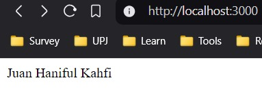

# webserver-configuration-project-finaltest
Proyek Akhir Membangun Web Server dan Reverse Proxy menggunakan NGINX dan Apache2 di WSL Ubuntu

Task:
<li>Default NGINX port 80 to 3000</li>
<li>Change the respons of / endpoint into my username</li>
<li>Add limitation request into 6 req per minutes</li>
 

Thanks!
